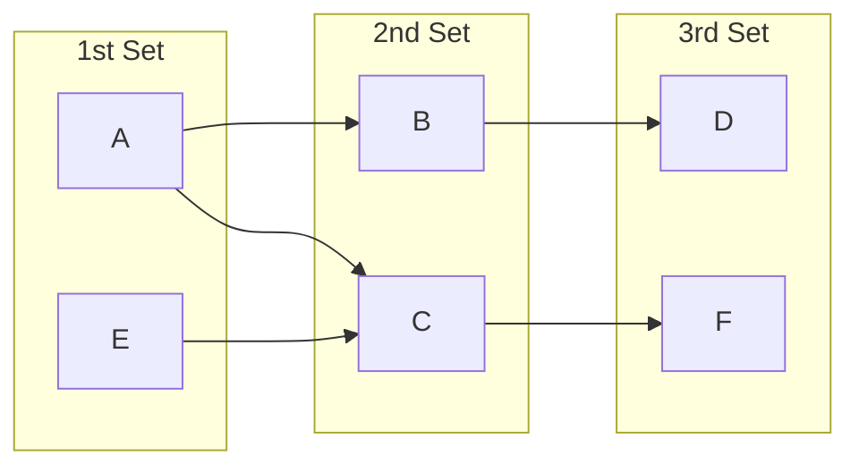
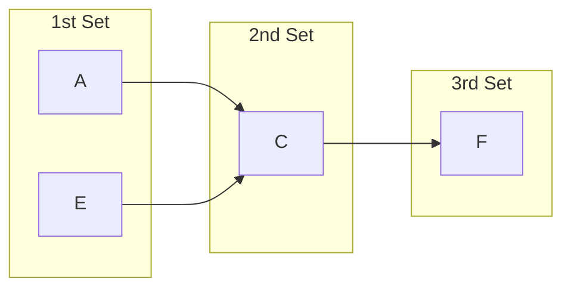

# Multikey Map

A map with multiple keys that map to a single value. For example, given a multikey map with:
- 1st set of keys: $`\{A, E\}`$.
- 2nd set of keys: $`\{B, C\}`$.
- 3rd set of keys: $`\{D, F\}`$.

With the following mapping between sets of keys:


Then $`\{A, B, D \}, \{A, C, F \}, \{E, C, F \}`$ are valid key sequences which map to a value i.e. each unique path maps to a value.

This is also equivalent to the following C++ code:
```cpp
multikey_map<T, T, T, std::string> my_map;
my_map[A][B][D] = "some value";
my_map[A][C][F] = "another value";
my_map[E][C][F] = "last value";
```

It is important to note that the selective search can only select all keys or one key for an index. It is not possible to multiselect a number of keys inbetween for an index.

### Selective Search

Multikey map's selective search allows neglecting a set of keys to expand the search for a set of values. For example (using the above example), if the search key sequence was:
- 1st key: any key.
- 2nd key: $`C`$.
- 3rd key: $`F`$.

The $`B`$ and $`D`$ keys are not considered in the search so the graph is simplified as:


All keys in the 1st set is considered in the search and all values mapped to the 2nd and 3rd keys will be returned. There will be as many values as there are edges between the 1st set of keys and 2nd key.

The following C++ code and output demonstrates this:
```cpp
multikey_map<T, T, T, std::string> my_map;
my_map[A][B][D] = "some value";
my_map[A][C][F] = "another value";
my_map[E][C][F] = "last value";

std::cout << my_map[my_map::any][C][F] << std::endl;
```

Outputs:
```
another value
last value
```

## Dependencies

- [GoogleTest](https://github.com/google/googletest)

## VSCode Extensions

- [C/C++](https://marketplace.visualstudio.com/items?itemName=ms-vscode.cpptools) by Microsoft
- [CMake](https://marketplace.visualstudio.com/items?itemName=twxs.cmake) by twxs
- [CMake Tools](https://marketplace.visualstudio.com/items?itemName=ms-vscode.cmake-tools) by Microsoft
- [C++ TestMate](https://marketplace.visualstudio.com/items?itemName=matepek.vscode-catch2-test-adapter) by Mate 
