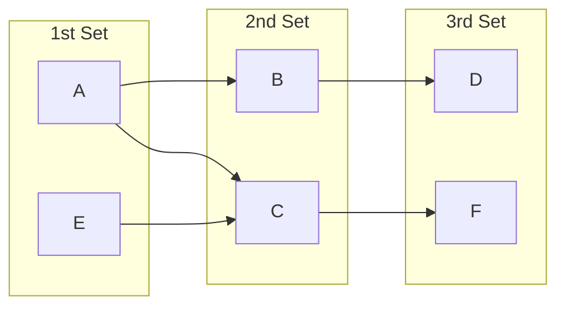

# Multikey Map


A map with multiple keys that map to a single value. For example, given a multikey map with:
- 1st set of keys: $`\{A, E\}`$.
- 2nd set of keys: $`\{B, C\}`$.
- 3rd set of keys: $`\{D, F\}`$.

With the following mapping between sets of keys:


Then $`\{A, B, D \}, \{A, C, F \}, \{E, C, F \}`$ are valid key sequences which map to a value i.e. each unique path maps to a value.

This is also equivalent to the following C++ code:
```cpp
multikey_map<T, T, T, std::string> my_map;
my_map[A][B][D] = "some value";
my_map[A][C][F] = "another value";
my_map[E][C][F] = "last value";
```
